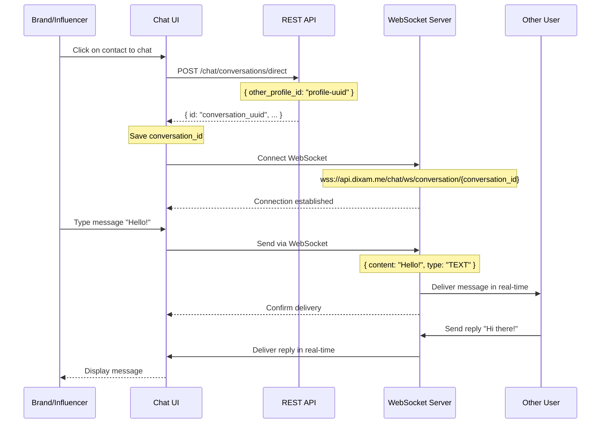

# WebSocket Chat Connection Flow - Complete Implementation Guide

## Overview

This guide explains how the conversation-based chat system connects brands and influencers via WebSocket for real-time messaging.

## Complete Flow: From Click to Real-time Chat



## Step-by-Step Implementation

### Step 1: User Clicks Contact to Start Chat

**Location**: `ConversationChatContainer.tsx`

```typescript
const handleContactSelect = async (contact: ChatContact) => {
  setIsCreatingConversation(true);
  try {
    // contact.id MUST be user UUID (not profile ID)
    console.log("Creating/finding conversation with user:", contact.id);
    
    // This calls the API: POST /chat/conversations/direct
    const conversation = await getOrCreateDirectConversation(contact.id);
    
    if (conversation) {
      // conversation.id is the conversation_id we need
      console.log("Conversation created/found:", conversation.id);
      setSelectedConversation(conversation);
      setView("conversations");
    }
  } catch (err) {
    console.error("Failed to create conversation:", err);
  } finally {
    setIsCreatingConversation(false);
  }
};
```

### Step 2: Create Direct Conversation API Call

**API Endpoint**: `POST /chat/conversations/direct`

**Request Body**:
```json
{
  "other_profile_id": "a1b2c3d4-e5f6-7890-abcd-ef1234567890"
}
```

**Important**: Use profile UUID from `chatable_influencers` or `chatable_brands` endpoints.

**Response**:
```json
{
  "id": "conversation-uuid-here",
  "type": "DIRECT",
  "participants": [
    {
      "user_id": "current-user-uuid",
      "username": "CurrentUser",
      "email": "current@example.com"
    },
    {
      "user_id": "other-user-uuid",
      "username": "OtherUser",
      "email": "other@example.com"
    }
  ],
  "unread_count": 0,
  "created_at": "2026-02-26T10:30:00Z"
}
```

**Implementation**: `src/api/services/chatService.ts`

```typescript
async createDirectConversation(
  payload: CreateDirectConversationPayload
): Promise<Conversation> {
  try {
    const response = await api.post<Conversation>(
      API_PATHS.CHAT.CREATE_DIRECT_CONVERSATION, // "/chat/conversations/direct"
      payload // { other_profile_id: "profile-uuid" }
    );
    console.log("Created direct conversation:", response.data);
    return response.data; // Contains conversation.id
  } catch (error) {
    console.error("Failed to create direct conversation:", error);
    throw error;
  }
}
```

**Hook**: `src/chat/hooks/useConversationsList.ts`

```typescript
const getOrCreateDirectConversation = async (otherUserId: string) => {
  // First, check if conversation already exists
  const existing = conversations.find((conv) => {
    if (conv.type !== 'DIRECT') return false;
    return conv.participants.some((p) => p.user_id === otherUserId);
  });

  if (existing) {
    console.log("Found existing conversation:", existing.id);
    return existing;
  }

  // Create new conversation
  return await createDirectConversation(otherUserId);
};
```

### Step 3: WebSocket Connection with conversation_id

**Location**: `ConversationChatRoom.tsx`

```typescript
export default function ConversationChatRoom({
  conversation,
  onMarkAsRead,
}: ConversationChatRoomProps) {
  // Auto-connect WebSocket when component mounts
  const {
    messages: wsMessages,
    sendMessage,
    isConnected,
    error: wsError,
    connect,
    disconnect,
  } = useConversationWebSocket({ 
    conversationId: conversation.id, // ← conversation_id from Step 2
    autoConnect: true 
  });

  // ... rest of component
}
```

**WebSocket Connection**: `src/chat/hooks/useConversationWebSocket.ts`

```typescript
export function useConversationWebSocket({
  conversationId, // ← The conversation_id from API response
  onMessageReceived,
  onConnectionChange,
  autoConnect = false,
}: UseConversationWebSocketProps) {
  const connect = useCallback(() => {
    if (!conversationId) {
      console.warn("Cannot connect: conversationId is required");
      return;
    }

    // Construct WebSocket URL
    // Format: wss://api.dixam.me/chat/ws/conversation/{conversation_id}
    const wsUrl = `${WS_BASE_URL}/chat/ws/conversation/${conversationId}`;
    
    console.log("Connecting to:", wsUrl);
    
    // Create WebSocket connection
    // Browser automatically sends HttpOnly cookies for authentication
    const ws = new WebSocket(wsUrl);
    wsRef.current = ws;

    ws.onopen = () => {
      console.log("✅ WebSocket connected to conversation:", conversationId);
      setIsConnected(true);
      // Both brand and influencer are now connected to the same conversation
    };

    ws.onmessage = (event) => {
      const message: ConversationMessage = JSON.parse(event.data);
      console.log("📨 Message received:", message);
      
      // Add message to state
      setMessages((prev) => [...prev, message]);
      onMessageReceived?.(message);
    };

    ws.onerror = (event) => {
      console.error("WebSocket error:", event);
    };

    ws.onclose = (event) => {
      console.log("WebSocket closed:", event.code, event.reason);
      setIsConnected(false);
    };
  }, [conversationId]);

  // Auto-connect when component mounts
  useEffect(() => {
    if (autoConnect && conversationId) {
      connect();
    }
    return () => disconnect();
  }, [conversationId, autoConnect]);

  return { sendMessage, isConnected, messages, error, connect, disconnect };
}
```

### Step 4: Send Message via WebSocket

```typescript
const sendMessage = useCallback(
  (content: string, type: 'TEXT' | 'IMAGE' | 'FILE' = 'TEXT') => {
    if (!wsRef.current || wsRef.current.readyState !== WebSocket.OPEN) {
      console.warn("Cannot send message: WebSocket not connected");
      return;
    }

    const payload: SendMessagePayload = {
      content: content.trim(),
      type,
    };

    console.log("📤 Sending message:", payload);
    wsRef.current.send(JSON.stringify(payload));
  },
  []
);
```

**Message Format Sent to Backend**:
```json
{
  "content": "Hello! How are you?",
  "type": "TEXT"
}
```

### Step 5: Receive Message from WebSocket

**Message Format Received from Backend**:
```json
{
  "id": "message-uuid",
  "conversation_id": "conversation-uuid",
  "sender_id": "sender-user-uuid",
  "sender_name": "John Doe",
  "content": "Hello! How are you?",
  "type": "TEXT",
  "timestamp": "2026-02-26T10:35:00Z",
  "created_at": "2026-02-26T10:35:00Z",
  "updated_at": "2026-02-26T10:35:00Z"
}
```

## API Endpoints Reference

### REST API

```typescript
// apiPaths.ts
CHAT: {
  // Create direct (1-on-1) conversation
  CREATE_DIRECT_CONVERSATION: "/chat/conversations/direct",
  
  // Create group conversation
  CREATE_GROUP_CONVERSATION: "/chat/conversations/group",
  
  // Get all conversations for current user
  GET_CONVERSATIONS_LIST: "/chat/conversations",
  
  // Get messages for a conversation
  GET_CONVERSATION_MESSAGES: (conversationId: string) =>
    `/chat/conversations/${conversationId}/messages`,
  
  // Mark conversation as read
  MARK_CONVERSATION_READ: (conversationId: string) =>
    `/chat/conversations/${conversationId}/read`,
  
  // Add participants to group
  ADD_PARTICIPANTS: (conversationId: string) =>
    `/chat/conversations/${conversationId}/participants`,
  
  // Remove participant from group
  REMOVE_PARTICIPANT: (conversationId: string, userId: string) =>
    `/chat/conversations/${conversationId}/participants/${userId}`,
}
```

### WebSocket

```typescript
// WebSocket endpoint for real-time messaging
WEBSOCKET: (conversation_id: string) => 
  `/chat/ws/conversation/${conversation_id}`

// Full URL: wss://api.dixam.me/chat/ws/conversation/{conversation_id}
```

## Authentication

### REST API
- Uses **HttpOnly cookies**
- Automatically included by `axios` with `withCredentials: true`
- Set during login at `/user/login`

### WebSocket
- Uses **HttpOnly cookies** (same as REST API)
- Browser **automatically** sends cookies with WebSocket connections to same domain
- No need to manually add authentication headers
- Backend validates cookie on connection

## Backend Requirements

Your backend MUST implement these endpoints:

### 1. Create Direct Conversation
```
POST /chat/conversations/direct
Content-Type: application/json

Request:
{
  "other_profile_id": "profile-uuid"
}

Response:
{
  "id": "conversation-uuid",
  "type": "DIRECT",
  "participants": [...],
  "created_at": "timestamp"
}
```

### 2. WebSocket Endpoint
```
WebSocket: /chat/ws/conversation/{conversation_id}

On Connection:
- Validate user session cookie
- Verify user is participant in conversation
- Join conversation room

On Message Received:
{
  "content": "message text",
  "type": "TEXT"
}

On Message Broadcast:
{
  "id": "message-uuid",
  "conversation_id": "conversation-uuid",
  "sender_id": "sender-uuid",
  "sender_name": "Sender Name",
  "content": "message text",
  "type": "TEXT",
  "timestamp": "ISO-8601",
  ...
}
```

## Testing the Connection

### 1. Open Browser Dev Tools

**Console Tab**:
```
=== WebSocket Connection Details ===
Base URL: wss://api.dixam.me
Conversation ID: a1b2c3d4-e5f6-7890-abcd-ef1234567890
Full WebSocket URL: wss://api.dixam.me/chat/ws/conversation/a1b2c3d4-e5f6-7890-abcd-ef1234567890
Expected Backend Path: /chat/ws/conversation/{id}
Authentication: HttpOnly cookies (automatic)
====================================
✅ WebSocket connected to conversation: a1b2c3d4-e5f6-7890-abcd-ef1234567890
```

**Network Tab** → **WS**:
- You should see WebSocket connection to `/chat/ws/conversation/{id}`
- Status: `101 Switching Protocols`
- Messages tab shows sent/received messages

### 2. Test with Two Users

**User A (Brand)**:
1. Login as brand
2. Click on an influencer to chat
3. Wait for "✅ WebSocket connected" in console
4. Send message: "Hello!"

**User B (Influencer)**:
1. Login as influencer
2. Open conversations list
3. See the conversation appear
4. Click to open
5. Wait for WebSocket connection
6. Should see "Hello!" message in real-time
7. Reply: "Hi there!"

**User A** should see "Hi there!" appear instantly!

## Troubleshooting

### WebSocket Not Connecting

**Problem**: Connection fails, shows error in console

**Solutions**:
1. Check user is logged in (cookies present)
2. Verify conversation_id is valid UUID
3. Check backend WebSocket endpoint is running
4. Verify backend path matches: `/chat/ws/conversation/{id}`
5. Check CORS/WebSocket settings on backend
6. Try accessing from same domain as backend

### Messages Not Appearing

**Problem**: Messages sent but not received by other user

**Solutions**:
1. Check both users are connected (isConnected === true)
2. Verify both users are in same conversation_id
3. Check backend is broadcasting to all participants
4. Check message format matches expected structure
5. Look for errors in backend logs

### "Cannot create conversation" Error

**Problem**: API call fails when clicking contact

**Solutions**:
1. Verify you're using contact.id (profile UUID from chatable_influencers/chatable_brands)
2. Check both profiles exist in backend database
3. Check authentication cookie is valid
4. Verify backend endpoint is `/chat/conversations/direct`
5. Check request body: `{ "other_profile_id": "profile-uuid" }`

## Key Points

✅ **conversation_id** is created by backend when calling CREATE_DIRECT_CONVERSATION
✅ Both users connect to **same conversation_id** via WebSocket
✅ **Authentication** via HttpOnly cookies (automatic)
✅ **Real-time**: Messages delivered via WebSocket, not REST API
✅ **Persistent**: Conversation_id stays same for both users
✅ **Use contact.id** (profile UUID from chatable endpoints)

## Complete Example

```typescript
// 1. User clicks contact
const handleContactClick = async (contactProfileId: string) => {
  // 2. Create/get conversation
  const conv = await chatService.createDirectConversation({
    other_profile_id: contactProfileId  // Profile UUID from chatable endpoints
  });
  
  // 3. Connect WebSocket with conversation_id
  const { sendMessage, isConnected } = useConversationWebSocket({
    conversationId: conv.id, // ← This is the key!
    autoConnect: true
  });
  
  // 4. Wait for connection
  if (isConnected) {
    // 5. Send message
    sendMessage("Hello!", "TEXT");
  }
};
```

---

**That's it!** The brand and influencer are now connected and can chat in real-time using the conversation_id as the bridge between them. 🎉
